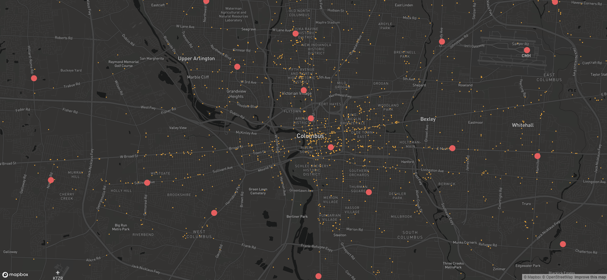

# community-services-locator-ui-2

Mapbox React Version of the Community Services Locator

# Steps to start developing

1. download [nvm](https://github.com/creationix/nvm)

2. Install node 10

3. clone the code base

4. run the following command `npm i` - installs all node dependencies

5. to start locally run the following command `npm start`

6. navigate to [localhost:3000](http://localhost:3000/)

Data provided through the [Smart Columbus OS](https://www.smartcolumbusos.com/data)

 - Data: Food Bank [Agency Locations](https://ckan.smartcolumbusos.com/dataset/food-pantry-and-user-data/resource/570a8e02-fb0e-4cee-895b-3b32bd740650)
 - Dataset uploaded through [jupyter notebook](https://jupyter.smartcolumbusos.com/user/ohioadam/lab/tree/Geocoder-to-CSV.ipynb) to geocode data, and saved as new csv
 - New csv uploaded to Mapbox as tileset (Map ID: mapbox://smrtcbus.9n1znhht)

